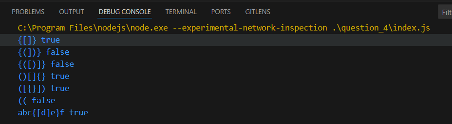

# Metrobi - Soltions to tasks

These are the solutions to the challenges given to me.

## Table of contents

- [Overview](#overview)
  - [The challenges](#the-challenge)
  - [Screenshots](#screenshots)
  - [Links](#links)
- [My process](#my-process)
  - [Built with](#built-with)
- [Author](#author)

## Overview

### The challenges

1. Write a javascript function that finds the duplicate items in any given array.
2. Write an async javascript function that writes every item in any given array with 1, 2, 4, 8, etc., seconds apart. Example: for [“a”, “b”, “c”, “d”], “a” is printed 1 second after the code runs, “b” is printed 2 seconds after the code runs, “c” is printed 4 seconds after the code runs, etc.
3. Write the necessary React code for generating the below figure (using flex).
4. Write an efficient method that tells us whether or not an input string brackets ("{", "}", "(", ")", "[", "]") opened and closed properly. Example: “{[]}” => true, “{(])}” => false, “{([)]}” => false
5. A building has 100 floors. One of the floors is the highest floor an egg can be dropped from without breaking. If an egg is dropped from above that floor, it will break. If it is dropped from that floor or below, it will be completely undamaged and you can drop the egg again. Given two eggs, find the highest floor an egg can be dropped from without breaking, with as few drops as possible in the worst-case scenario.
6. Write the code that animates “Zeno's Paradox of Achilles and the Tortoise” on an interface(we would like to see the paradox demonstrated).
7. Think that you have an unlimited number of carrots, but a limited number of carrot types. Also, you have one bag that can hold a limited weight. Each type of carrot has a weight and a price. Write a function that takes carrotTypes and capacity and return the maximum value the bag can hold. [Python or Javascript]
   Example:
   carrotTypes = [{kg: 5, price: 100}, {kg: 7, price: 150}, {kg: 3, price: 70}] capacity = 36 //kg
   getMaxValue(carrotTypes, capacity)

### Screenshots

### Links

- Solution URLs:
  [Question 1](https://github.com/Tomi-pter/Metrobi_tasks/tree/main/question_1)
  [Question 2](https://github.com/Tomi-pter/Metrobi_tasks/tree/main/question_2)
  [Question 3](https://github.com/Tomi-pter/Metrobi_tasks/tree/main/question_3)
  [Question 4](https://github.com/Tomi-pter/Metrobi_tasks/tree/main/question_4)
  [Question 5](https://github.com/Tomi-pter/Metrobi_tasks/tree/main/question_5)
  [Question 6](https://github.com/Tomi-pter/Metrobi_tasks/tree/main/question_6)
  [Question 7](https://github.com/Tomi-pter/Metrobi_tasks/tree/main/question_7)

## My process

### Built with

- HTML5
- Vanilla CSS
- Flexbox
- Tailwind
- Javascript
- React
- Vite

## Author

- Website - [TomiPter](https://www.tomipter.com)
